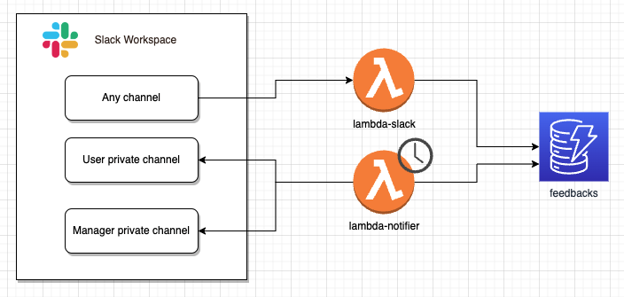

# Slack Feedbacks Application

Slack Application to collect user feedbacks. Application accepts and regularly notifies users who received feedback and optionally their manager.

Main Components

Details are available in the blog post:

<https://omakoleg.gitlab.io//posts/cdk-slack-feedbacks>
